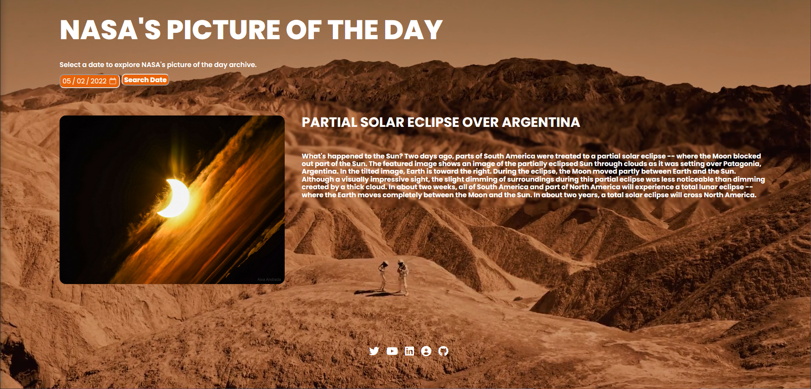

  <h1>NASA Picture of the Day Explorer</h1>
   
   
Delve into an intergalactic journey of discovery with our NASA Picture of the Day Explorer! Experience breathtaking images from the vastness of space with a mesmerizing video background. Choose any date you like and bask in the beauty of the cosmos, with a simple yet powerful interface that brings the universe to your fingertips. Get up close and personal with each picture, accompanied by a descriptive title and insightful explanation. And don't forget to share your interstellar adventures with your friends and followers through the integrated social media links. Get ready for a truly out-of-this-world experience!

    
<h3 align="center" color="white">Nasa's picture of the day archive explorer</h2>
				
  
					
					 
					 
					

						  
							
					

					 
<strong>JavaScript, CSS3, HTML5</strong> - Web application that allows you to explore Nasa's picture of the day archive!

				

        
   
Tech Stack:

      <ul>
        <li>HTML 5</li>
        <li>CSS 3</li>
        <li>JavaScript</li>
      </ul>
      
&nbsp&nbsp&nbsp

Made with ❤ by Ameen

